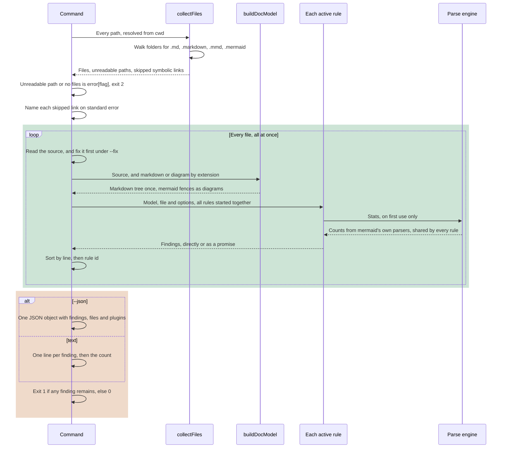

```mermaid
sequenceDiagram
    participant CLI as Command
    participant F as collectFiles
    participant M as buildDocModel
    participant R as Each active rule
    participant E as Parse engine

    CLI->>F: Every path, resolved from cwd
    F->>F: Walk folders for .md, .markdown, .mmd, .mermaid
    F-->>CLI: Files, unreadable paths, skipped symbolic links
    CLI->>CLI: Unreadable path or no files is error[flag], exit 2
    CLI->>CLI: Name each skipped link on standard error

    rect rgba(21, 128, 61, 0.21)
    loop Every file, all at once
        CLI->>CLI: Read the source, and fix it first under --fix
        CLI->>M: Source, and markdown or diagram by extension
        M-->>CLI: Markdown tree once, mermaid fences as diagrams
        CLI->>R: Model, file and options, all rules started together
        R->>E: Stats, on first use only
        E-->>R: Counts from mermaid's own parsers, shared by every rule
        R-->>CLI: Findings, directly or as a promise
        CLI->>CLI: Sort by line, then rule id
    end
    end

    rect rgba(180, 83, 9, 0.21)
    alt --json
        CLI->>CLI: One JSON object with findings, files and plugins
    else text
        CLI->>CLI: One line per finding, then the count
    end
    CLI->>CLI: Exit 1 if any finding remains, else 0
    end
```
