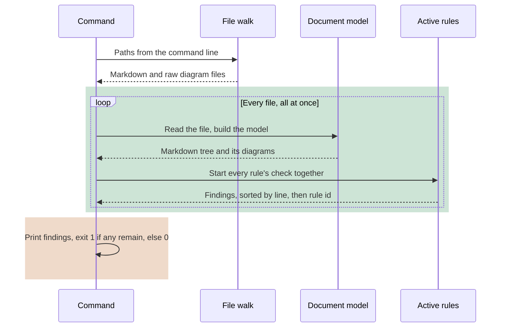

```mermaid
sequenceDiagram
    participant CLI as Command
    participant F as File walk
    participant M as Document model
    participant R as Active rules

    CLI->>F: Paths from the command line
    F-->>CLI: Markdown and raw diagram files
    rect rgba(21, 128, 61, 0.21)
    loop Every file, all at once
        CLI->>M: Read the file, build the model
        M-->>CLI: Markdown tree and its diagrams
        CLI->>R: Start every rule's check together
        R-->>CLI: Findings, sorted by line, then rule id
    end
    end
    rect rgba(180, 83, 9, 0.21)
    CLI->>CLI: Print findings, exit 1 if any remain, else 0
    end
```
