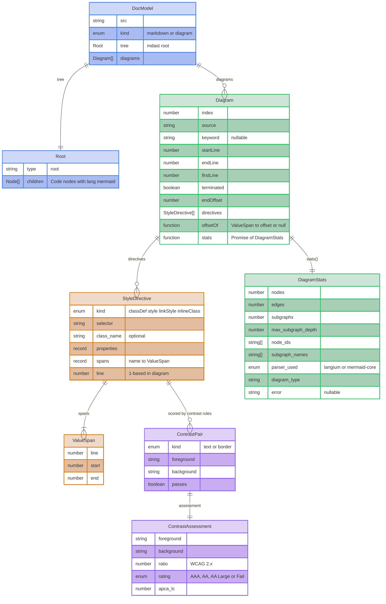

```mermaid
erDiagram
    DocModel ||--|| Root : "tree"
    DocModel ||--o{ Diagram : "diagrams"
    Diagram ||--o{ StyleDirective : "directives"
    StyleDirective ||--|{ ValueSpan : "spans"
    Diagram ||--|| DiagramStats : "stats()"
    StyleDirective ||--o{ ContrastPair : "scored by contrast rules"
    ContrastPair ||--|| ContrastAssessment : "assessment"

    DocModel {
        string src
        enum kind "markdown or diagram"
        Root tree "mdast root"
        Diagram[] diagrams
    }
    Root {
        string type "root"
        Node[] children "Code nodes with lang mermaid"
    }
    Diagram {
        number index
        string source
        string keyword "nullable"
        number startLine
        number endLine
        number firstLine
        boolean terminated
        number endOffset
        StyleDirective[] directives
        function offsetOf "ValueSpan to offset or null"
        function stats "Promise of DiagramStats"
    }
    StyleDirective {
        enum kind "classDef style linkStyle inlineClass"
        string selector
        string class_name "optional"
        record properties
        record spans "name to ValueSpan"
        number line "1-based in diagram"
    }
    ValueSpan {
        number line
        number start
        number end
    }
    DiagramStats {
        number nodes
        number edges
        number subgraphs
        number max_subgraph_depth
        string[] node_ids
        string[] subgraph_names
        enum parser_used "langium or mermaid-core"
        string diagram_type
        string error "nullable"
    }
    ContrastPair {
        enum kind "text or border"
        string foreground
        string background
        boolean passes
    }
    ContrastAssessment {
        string foreground
        string background
        number ratio "WCAG 2.x"
        enum rating "AAA, AA, AA Large or Fail"
        number apca_lc
    }

    classDef docTint fill:#1d4ed836,stroke:#3b82f6,stroke-width:2px
    classDef diagramTint fill:#15803d36,stroke:#22c55e,stroke-width:2px
    classDef styleTint fill:#b4530936,stroke:#d97706,stroke-width:2px
    classDef scoreTint fill:#6d28d936,stroke:#8b5cf6,stroke-width:2px
    class DocModel,Root docTint
    class Diagram,DiagramStats diagramTint
    class StyleDirective,ValueSpan styleTint
    class ContrastPair,ContrastAssessment scoreTint
```
