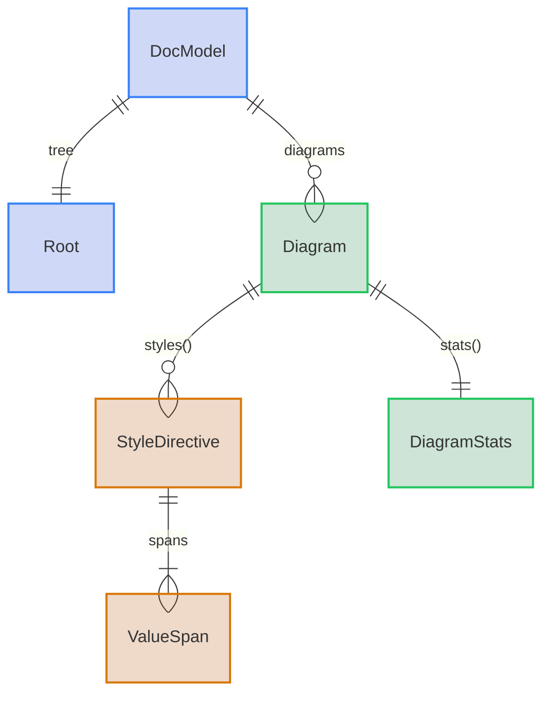

```mermaid
erDiagram
    DocModel ||--|| Root : "tree"
    DocModel ||--o{ Diagram : "diagrams"
    Diagram ||--o{ StyleDirective : "styles()"
    StyleDirective ||--|{ ValueSpan : "spans"
    Diagram ||--|| DiagramStats : "stats()"

    classDef docTint fill:#1d4ed836,stroke:#3b82f6,stroke-width:2px
    classDef diagramTint fill:#15803d36,stroke:#22c55e,stroke-width:2px
    classDef styleTint fill:#b4530936,stroke:#d97706,stroke-width:2px
    class DocModel,Root docTint
    class Diagram,DiagramStats diagramTint
    class StyleDirective,ValueSpan styleTint
```
