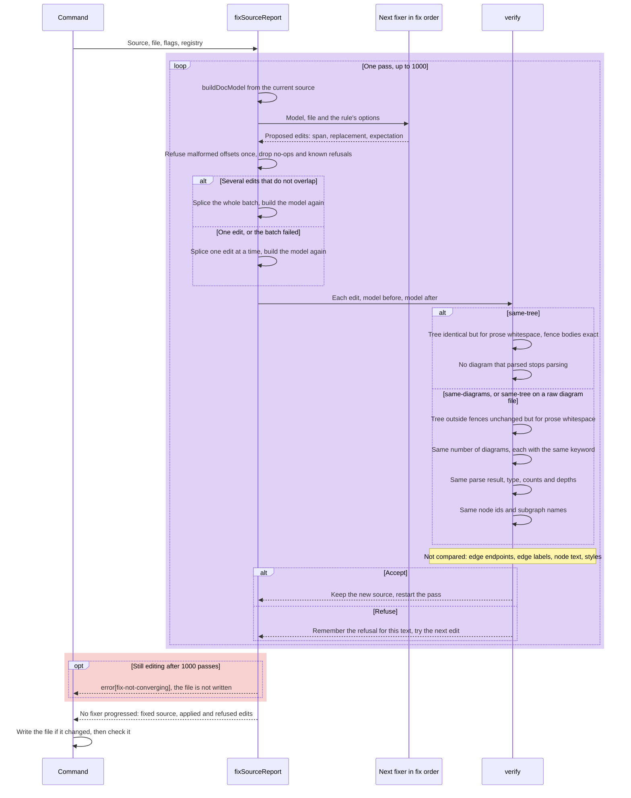

```mermaid
sequenceDiagram
    participant CLI as Command
    participant E as fixSourceReport
    participant X as Next fixer in fix order
    participant V as verify

    CLI->>E: Source, file, flags, registry
    rect rgba(109, 40, 217, 0.21)
    loop One pass, up to 1000
        E->>E: buildDocModel from the current source
        E->>X: Model, file and the rule's options
        X-->>E: Proposed edits: span, replacement, expectation
        E->>E: Refuse malformed offsets once, drop no-ops and known refusals
        alt Several edits that do not overlap
            E->>E: Splice the whole batch, build the model again
        else One edit, or the batch failed
            E->>E: Splice one edit at a time, build the model again
        end
        E->>V: Each edit, model before, model after
        alt same-tree
            V->>V: Tree identical but for prose whitespace, fence bodies exact
            V->>V: No diagram that parsed stops parsing
        else same-diagrams, or same-tree on a raw diagram file
            V->>V: Tree outside fences unchanged but for prose whitespace
            V->>V: Same number of diagrams, each with the same keyword
            V->>V: Same parse result, type, counts and depths
            V->>V: Same node ids and subgraph names
        end
        Note over V: Not compared: edge endpoints, edge labels, node text, styles
        alt Accept
            V-->>E: Keep the new source, restart the pass
        else Refuse
            V-->>E: Remember the refusal for this text, try the next edit
        end
    end
    end
    rect rgba(220, 38, 38, 0.21)
    opt Still editing after 1000 passes
        E-->>CLI: error[fix-not-converging], the file is not written
    end
    end
    E-->>CLI: No fixer progressed: fixed source, applied and refused edits
    CLI->>CLI: Write the file if it changed, then check it
```
