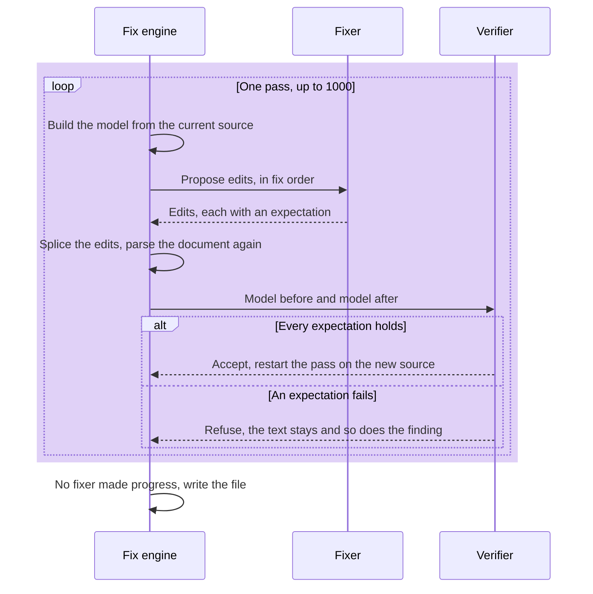

```mermaid
sequenceDiagram
    participant E as Fix engine
    participant X as Fixer
    participant V as Verifier

    rect rgba(109, 40, 217, 0.21)
    loop One pass, up to 1000
        E->>E: Build the model from the current source
        E->>X: Propose edits, in fix order
        X-->>E: Edits, each with an expectation
        E->>E: Splice the edits, parse the document again
        E->>V: Model before and model after
        alt Every expectation holds
            V-->>E: Accept, restart the pass on the new source
        else An expectation fails
            V-->>E: Refuse, the text stays and so does the finding
        end
    end
    end
    E->>E: No fixer made progress, write the file
```
