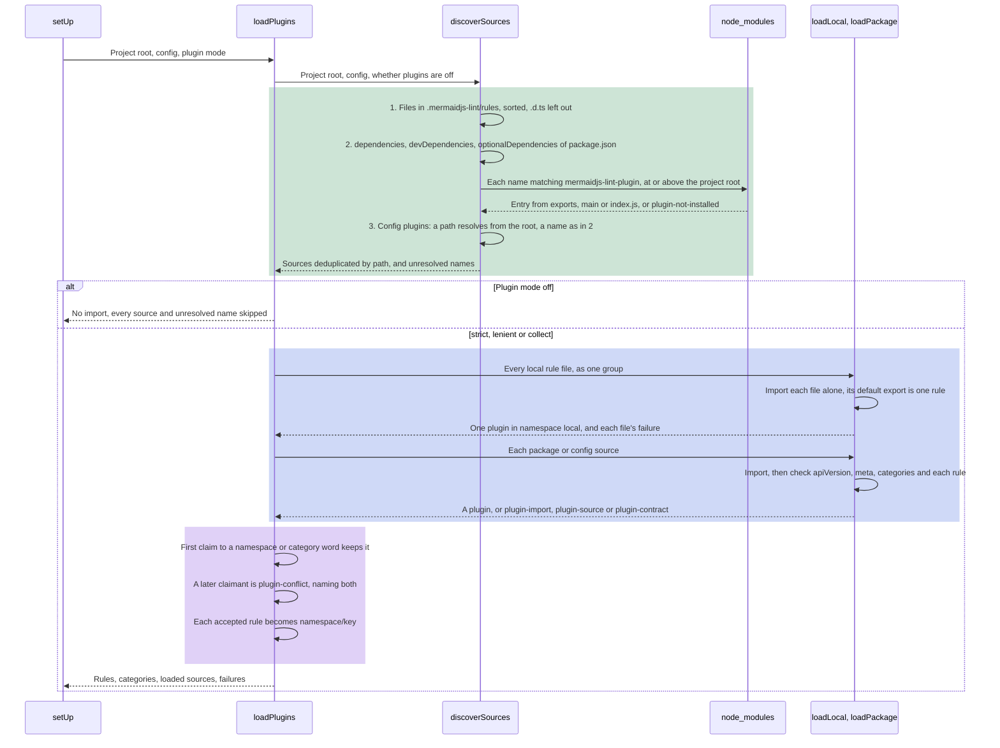

```mermaid
sequenceDiagram
    participant S as setUp
    participant P as loadPlugins
    participant D as discoverSources
    participant N as node_modules
    participant L as loadLocal, loadPackage

    S->>P: Project root, config, plugin mode
    P->>D: Project root, config, whether plugins are off
    rect rgba(21, 128, 61, 0.21)
    D->>D: 1. Files in .mermaidjs-lint/rules, sorted, .d.ts left out
    D->>D: 2. dependencies, devDependencies, optionalDependencies of package.json
    D->>N: Each name matching mermaidjs-lint-plugin, at or above the project root
    N-->>D: Entry from exports, main or index.js, or plugin-not-installed
    D->>D: 3. Config plugins: a path resolves from the root, a name as in 2
    D-->>P: Sources deduplicated by path, and unresolved names
    end
    alt Plugin mode off
        P-->>S: No import, every source and unresolved name skipped
    else strict, lenient or collect
        rect rgba(29, 78, 216, 0.21)
        P->>L: Every local rule file, as one group
        L->>L: Import each file alone, its default export is one rule
        L-->>P: One plugin in namespace local, and each file's failure
        P->>L: Each package or config source
        L->>L: Import, then check apiVersion, meta, categories and each rule
        L-->>P: A plugin, or plugin-import, plugin-source or plugin-contract
        end
        rect rgba(109, 40, 217, 0.21)
        P->>P: First claim to a namespace or category word keeps it
        P->>P: A later claimant is plugin-conflict, naming both
        P->>P: Each accepted rule becomes namespace/key
        end
        P-->>S: Rules, categories, loaded sources, failures
    end
```
