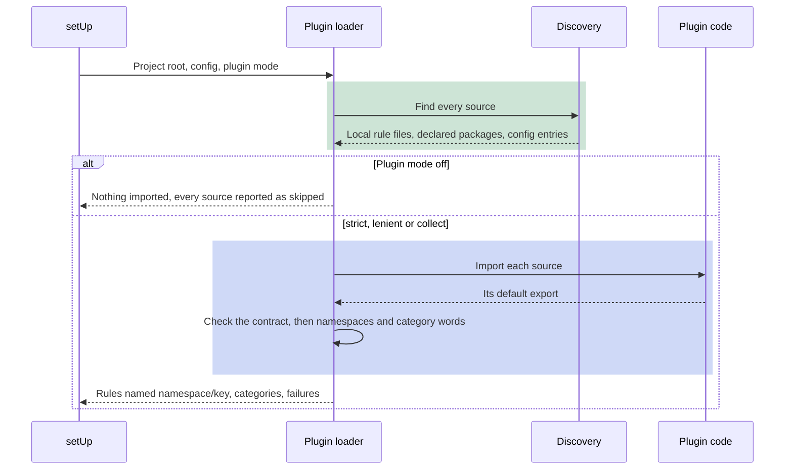

```mermaid
sequenceDiagram
    participant S as setUp
    participant P as Plugin loader
    participant D as Discovery
    participant M as Plugin code

    S->>P: Project root, config, plugin mode
    rect rgba(21, 128, 61, 0.21)
    P->>D: Find every source
    D-->>P: Local rule files, declared packages, config entries
    end
    alt Plugin mode off
        P-->>S: Nothing imported, every source reported as skipped
    else strict, lenient or collect
        rect rgba(29, 78, 216, 0.21)
        P->>M: Import each source
        M-->>P: Its default export
        P->>P: Check the contract, then namespaces and category words
        end
        P-->>S: Rules named namespace/key, categories, failures
    end
```
