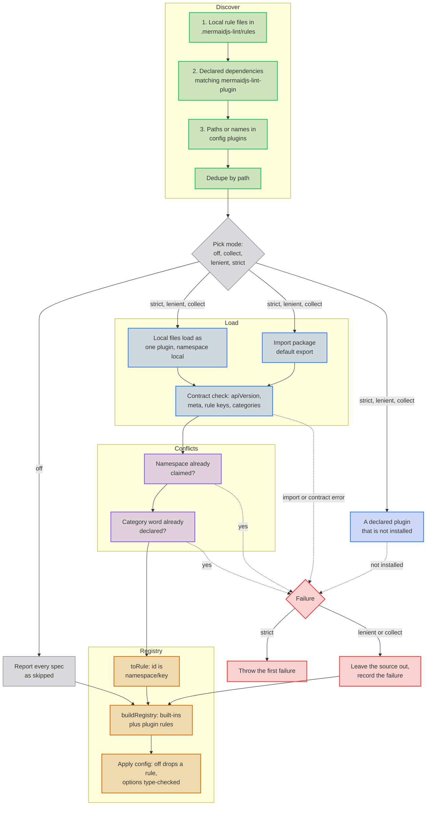

```mermaid
flowchart TB
    PM{"Pick mode:<br/>off, collect,<br/>lenient, strict"}
    subgraph Discover
        D1["1. Local rule files in<br/>.mermaidjs-lint/rules"]
        D2["2. Declared dependencies<br/>matching mermaidjs-lint-plugin"]
        D3["3. Paths or names in<br/>config plugins"]
        DD["Dedupe by path"]
    end
    subgraph Load
        LL["Local files load as<br/>one plugin, namespace local"]
        LP["Import package<br/>default export"]
        CC["Contract check: apiVersion,<br/>meta, rule keys, categories"]
    end
    subgraph Conflicts
        NS["Namespace already<br/>claimed?"]
        CW["Category word already<br/>declared?"]
    end
    subgraph Registry
        TR["toRule: id is<br/>namespace/key"]
        BR["buildRegistry: built-ins<br/>plus plugin rules"]
        AC["Apply config: off drops a rule,<br/>options type-checked"]
    end
    F{"Failure"}
    X["Throw the first failure"]
    S["Leave the source out,<br/>record the failure"]
    K["Report every spec<br/>as skipped"]

    D1 --> D2 --> D3 --> DD --> PM
    PM -->|off| K
    K --> BR
    PM -->|"strict, lenient, collect"| LL --> CC
    PM -->|"strict, lenient, collect"| LP --> CC
    CC --> NS --> CW --> TR --> BR --> AC
    PM -->|"strict, lenient, collect"| NI["A declared plugin<br/>that is not installed"]
    NI -. "not installed" .-> F
    CC -. "import or contract error" .-> F
    NS -. "yes" .-> F
    CW -. "yes" .-> F
    F -->|strict| X
    F -->|"lenient or collect"| S
    S --> BR

    classDef discoverTint fill:#15803d36,stroke:#22c55e,stroke-width:2px
    classDef loadTint fill:#1d4ed836,stroke:#3b82f6,stroke-width:2px
    classDef conflictTint fill:#6d28d936,stroke:#8b5cf6,stroke-width:2px
    classDef registryTint fill:#b4530936,stroke:#d97706,stroke-width:2px
    classDef failTint fill:#dc262636,stroke:#ef4444,stroke-width:2px
    classDef modeTint fill:#52525b36,stroke:#71717a,stroke-width:1px
    class D1,D2,D3,DD discoverTint
    class LL,LP,CC,NI loadTint
    class NS,CW conflictTint
    class TR,BR,AC registryTint
    class F,X,S failTint
    class PM,K modeTint
```
