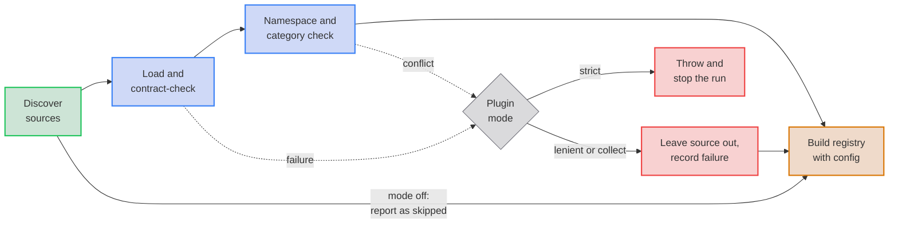

```mermaid
flowchart LR
    D["Discover<br/>sources"] --> L["Load and<br/>contract-check"]
    L --> C["Namespace and<br/>category check"]
    C --> R["Build registry<br/>with config"]
    L -. failure .-> M{"Plugin<br/>mode"}
    C -. conflict .-> M
    M -->|strict| X["Throw and<br/>stop the run"]
    M -->|"lenient or collect"| S["Leave source out,<br/>record failure"]
    S --> R
    D -->|"mode off:<br/>report as skipped"| R

    classDef discoverTint fill:#15803d36,stroke:#22c55e,stroke-width:2px
    classDef loadTint fill:#1d4ed836,stroke:#3b82f6,stroke-width:2px
    classDef registryTint fill:#b4530936,stroke:#d97706,stroke-width:2px
    classDef failTint fill:#dc262636,stroke:#ef4444,stroke-width:2px
    classDef modeTint fill:#52525b36,stroke:#71717a,stroke-width:1px
    class D discoverTint
    class L,C loadTint
    class R registryTint
    class X,S failTint
    class M modeTint
```
