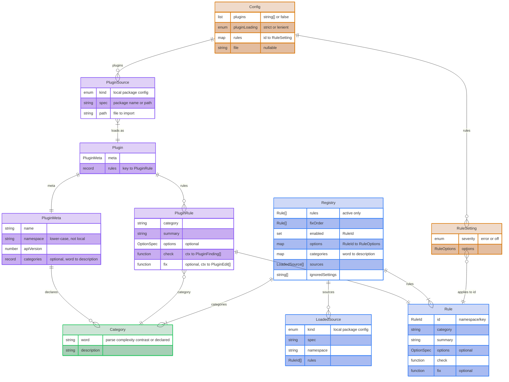

```mermaid
erDiagram
    PluginSource }|--|| Plugin : "loads as"
    Plugin ||--|| PluginMeta : "meta"
    Plugin ||--o{ PluginRule : "rules"
    PluginMeta ||--o{ Category : "declares"
    PluginRule }o--|| Category : "category"
    PluginRule ||--|| Rule : "becomes namespace/key"
    Registry ||--|{ Rule : "rules"
    Registry ||--|{ Category : "categories"
    Registry ||--o{ LoadedSource : "sources"
    Config ||--o{ RuleSetting : "rules"
    RuleSetting }o--|| Rule : "applies to id"
    Config ||--o{ PluginSource : "plugins"

    PluginSource {
        enum kind "local package config"
        string spec "package name or path"
        string path "file to import"
    }
    Plugin {
        PluginMeta meta
        record rules "key to PluginRule"
    }
    PluginMeta {
        string name
        string namespace "lower-case, not local"
        number apiVersion
        record categories "optional, word to description"
    }
    PluginRule {
        string category
        string summary
        OptionSpec options "optional"
        function check "ctx to PluginFinding[]"
        function fix "optional, ctx to PluginEdit[]"
    }
    Category {
        string word "parse complexity contrast or declared"
        string description
    }
    Rule {
        RuleId id "namespace/key"
        string category
        string summary
        OptionSpec options "optional"
        function check
        function fix "optional"
    }
    Registry {
        Rule[] rules "active only"
        Rule[] fixOrder
        set enabled "RuleId"
        map options "RuleId to RuleOptions"
        map categories "word to description"
        LoadedSource[] sources
        string[] ignoredSettings
    }
    LoadedSource {
        enum kind "local package config"
        string spec
        string namespace
        RuleId[] rules
    }
    Config {
        list plugins "string[] or false"
        enum pluginLoading "strict or lenient"
        map rules "id to RuleSetting"
        string file "nullable"
    }
    RuleSetting {
        enum severity "error or off"
        RuleOptions options
    }

    classDef pluginTint fill:#6d28d936,stroke:#8b5cf6,stroke-width:2px
    classDef ruleTint fill:#1d4ed836,stroke:#3b82f6,stroke-width:2px
    classDef configTint fill:#b4530936,stroke:#d97706,stroke-width:2px
    classDef wordTint fill:#15803d36,stroke:#22c55e,stroke-width:2px
    class PluginSource,Plugin,PluginMeta,PluginRule pluginTint
    class Rule,Registry,LoadedSource ruleTint
    class Config,RuleSetting configTint
    class Category wordTint
```
