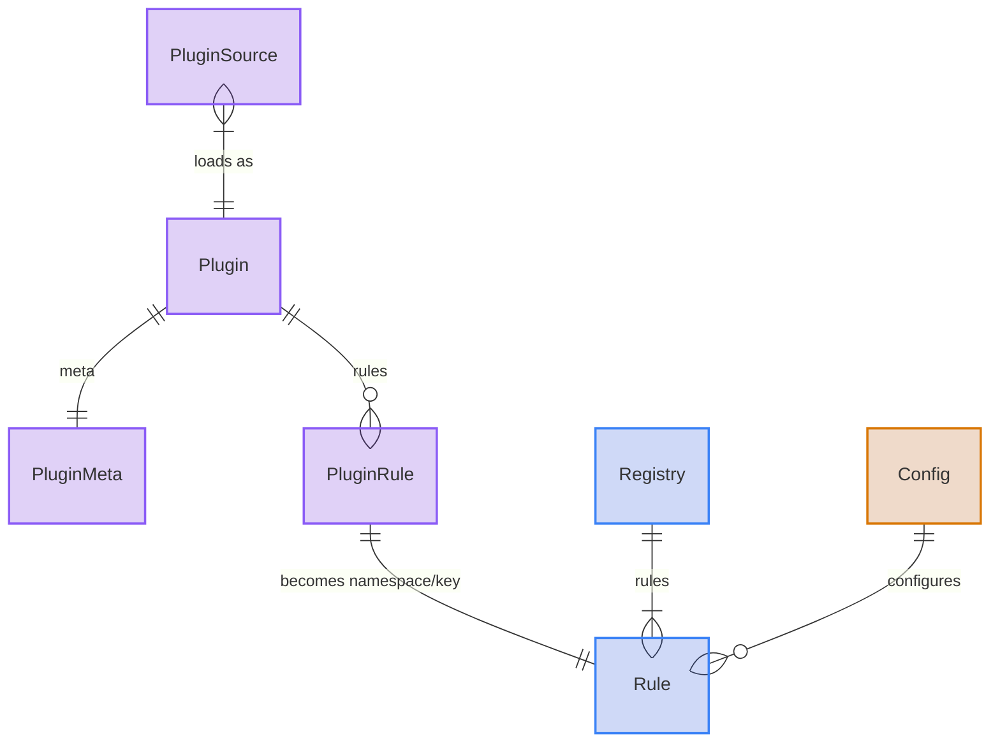

```mermaid
erDiagram
    PluginSource }|--|| Plugin : "loads as"
    Plugin ||--|| PluginMeta : "meta"
    Plugin ||--o{ PluginRule : "rules"
    PluginRule ||--|| Rule : "becomes namespace/key"
    Registry ||--|{ Rule : "rules"
    Config ||--o{ Rule : "configures"

    classDef pluginTint fill:#6d28d936,stroke:#8b5cf6,stroke-width:2px
    classDef ruleTint fill:#1d4ed836,stroke:#3b82f6,stroke-width:2px
    classDef configTint fill:#b4530936,stroke:#d97706,stroke-width:2px
    class PluginSource,Plugin,PluginMeta,PluginRule pluginTint
    class Rule,Registry ruleTint
    class Config configTint
```
