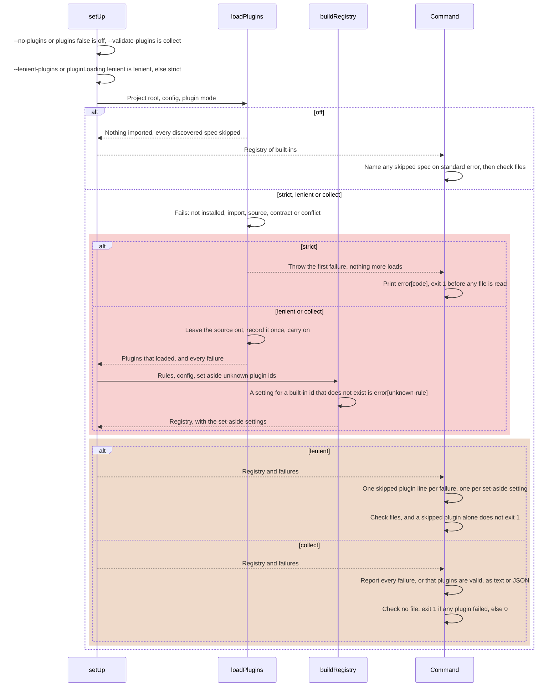

```mermaid
sequenceDiagram
    participant S as setUp
    participant P as loadPlugins
    participant G as buildRegistry
    participant CLI as Command

    S->>S: --no-plugins or plugins false is off, --validate-plugins is collect
    S->>S: --lenient-plugins or pluginLoading lenient is lenient, else strict
    S->>P: Project root, config, plugin mode
    alt off
        P-->>S: Nothing imported, every discovered spec skipped
        S-->>CLI: Registry of built-ins
        CLI->>CLI: Name any skipped spec on standard error, then check files
    else strict, lenient or collect
        P->>P: Fails: not installed, import, source, contract or conflict
        rect rgba(220, 38, 38, 0.21)
        alt strict
            P-->>CLI: Throw the first failure, nothing more loads
            CLI->>CLI: Print error[code], exit 1 before any file is read
        else lenient or collect
            P->>P: Leave the source out, record it once, carry on
            P-->>S: Plugins that loaded, and every failure
            S->>G: Rules, config, set aside unknown plugin ids
            G->>G: A setting for a built-in id that does not exist is error[unknown-rule]
            G-->>S: Registry, with the set-aside settings
        end
        end
        rect rgba(180, 83, 9, 0.21)
        alt lenient
            S-->>CLI: Registry and failures
            CLI->>CLI: One skipped plugin line per failure, one per set-aside setting
            CLI->>CLI: Check files, and a skipped plugin alone does not exit 1
        else collect
            S-->>CLI: Registry and failures
            CLI->>CLI: Report every failure, or that plugins are valid, as text or JSON
            CLI->>CLI: Check no file, exit 1 if any plugin failed, else 0
        end
        end
    end
```
