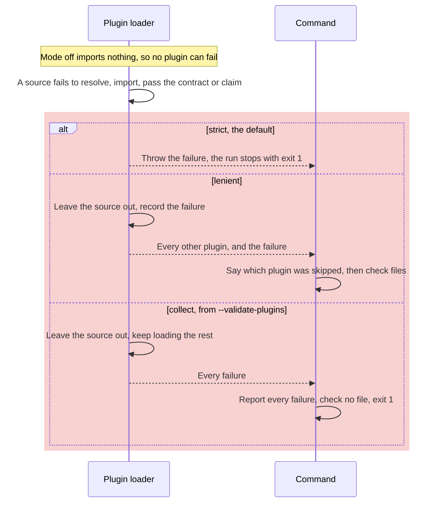

```mermaid
sequenceDiagram
    participant P as Plugin loader
    participant CLI as Command

    Note over P: Mode off imports nothing, so no plugin can fail
    P->>P: A source fails to resolve, import, pass the contract or claim
    rect rgba(220, 38, 38, 0.21)
    alt strict, the default
        P-->>CLI: Throw the failure, the run stops with exit 1
    else lenient
        P->>P: Leave the source out, record the failure
        P-->>CLI: Every other plugin, and the failure
        CLI->>CLI: Say which plugin was skipped, then check files
    else collect, from --validate-plugins
        P->>P: Leave the source out, keep loading the rest
        P-->>CLI: Every failure
        CLI->>CLI: Report every failure, check no file, exit 1
    end
    end
```
