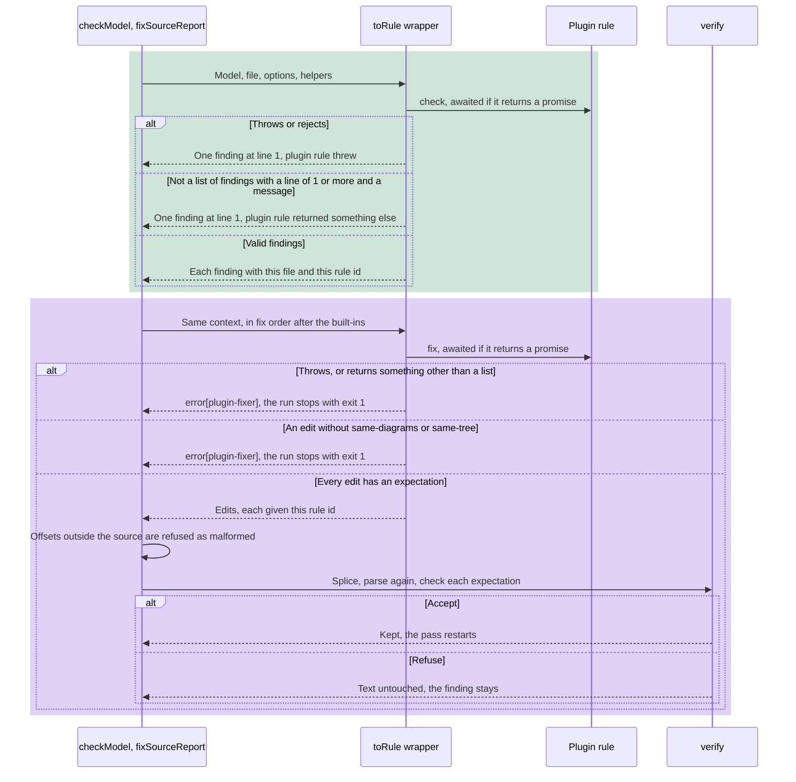

```mermaid
sequenceDiagram
    participant E as checkModel, fixSourceReport
    participant W as toRule wrapper
    participant R as Plugin rule
    participant V as verify

    rect rgba(21, 128, 61, 0.21)
    E->>W: Model, file, options, helpers
    W->>R: check, awaited if it returns a promise
    alt Throws or rejects
        W-->>E: One finding at line 1, plugin rule threw
    else Not a list of findings with a line of 1 or more and a message
        W-->>E: One finding at line 1, plugin rule returned something else
    else Valid findings
        W-->>E: Each finding with this file and this rule id
    end
    end

    rect rgba(109, 40, 217, 0.21)
    E->>W: Same context, in fix order after the built-ins
    W->>R: fix, awaited if it returns a promise
    alt Throws, or returns something other than a list
        W-->>E: error[plugin-fixer], the run stops with exit 1
    else An edit without same-diagrams or same-tree
        W-->>E: error[plugin-fixer], the run stops with exit 1
    else Every edit has an expectation
        W-->>E: Edits, each given this rule id
        E->>E: Offsets outside the source are refused as malformed
        E->>V: Splice, parse again, check each expectation
        alt Accept
            V-->>E: Kept, the pass restarts
        else Refuse
            V-->>E: Text untouched, the finding stays
        end
    end
    end
```
