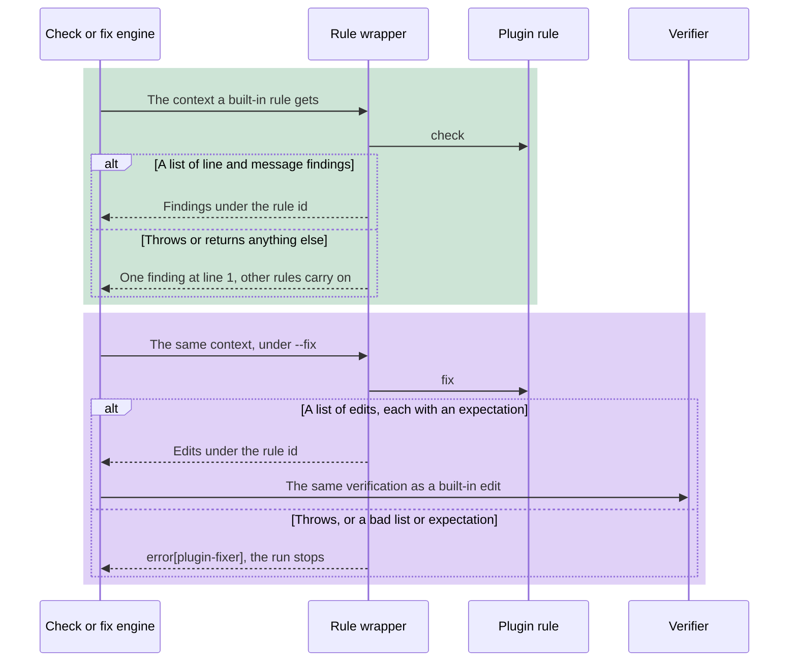

```mermaid
sequenceDiagram
    participant E as Check or fix engine
    participant W as Rule wrapper
    participant R as Plugin rule
    participant V as Verifier

    rect rgba(21, 128, 61, 0.21)
    E->>W: The context a built-in rule gets
    W->>R: check
    alt A list of line and message findings
        W-->>E: Findings under the rule id
    else Throws or returns anything else
        W-->>E: One finding at line 1, other rules carry on
    end
    end
    rect rgba(109, 40, 217, 0.21)
    E->>W: The same context, under --fix
    W->>R: fix
    alt A list of edits, each with an expectation
        W-->>E: Edits under the rule id
        E->>V: The same verification as a built-in edit
    else Throws, or a bad list or expectation
        W-->>E: error[plugin-fixer], the run stops
    end
    end
```
