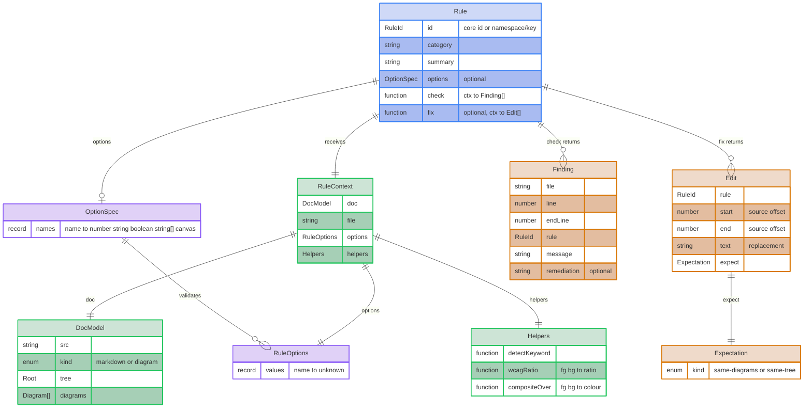

```mermaid
erDiagram
    Rule ||--|| RuleContext : "receives"
    Rule ||--o| OptionSpec : "options"
    OptionSpec ||--o{ RuleOptions : "validates"
    RuleContext ||--|| DocModel : "doc"
    RuleContext ||--|| RuleOptions : "options"
    RuleContext ||--|| Helpers : "helpers"
    Rule ||--o{ Finding : "check returns"
    Rule ||--o{ Edit : "fix returns"
    Edit ||--|| Expectation : "expect"

    Rule {
        RuleId id "core id or namespace/key"
        string category
        string summary
        OptionSpec options "optional"
        function check "ctx to Finding[]"
        function fix "optional, ctx to Edit[]"
    }
    RuleContext {
        DocModel doc
        string file
        RuleOptions options
        Helpers helpers
    }
    DocModel {
        string src
        enum kind "markdown or diagram"
        Root tree
        Diagram[] diagrams
    }
    OptionSpec {
        record names "name to number string boolean string[] canvas"
    }
    RuleOptions {
        record values "name to unknown"
    }
    Helpers {
        function detectKeyword
        function wcagRatio "fg bg to ratio"
        function compositeOver "fg bg to colour"
    }
    Finding {
        string file
        number line
        number endLine
        RuleId rule
        string message
        string remediation "optional"
    }
    Edit {
        RuleId rule
        number start "source offset"
        number end "source offset"
        string text "replacement"
        Expectation expect
    }
    Expectation {
        enum kind "same-diagrams or same-tree"
    }

    classDef ruleTint fill:#1d4ed836,stroke:#3b82f6,stroke-width:2px
    classDef inputTint fill:#15803d36,stroke:#22c55e,stroke-width:2px
    classDef outputTint fill:#b4530936,stroke:#d97706,stroke-width:2px
    classDef optionTint fill:#6d28d936,stroke:#8b5cf6,stroke-width:2px
    class Rule ruleTint
    class RuleContext,DocModel,Helpers inputTint
    class Finding,Edit,Expectation outputTint
    class OptionSpec,RuleOptions optionTint
```
