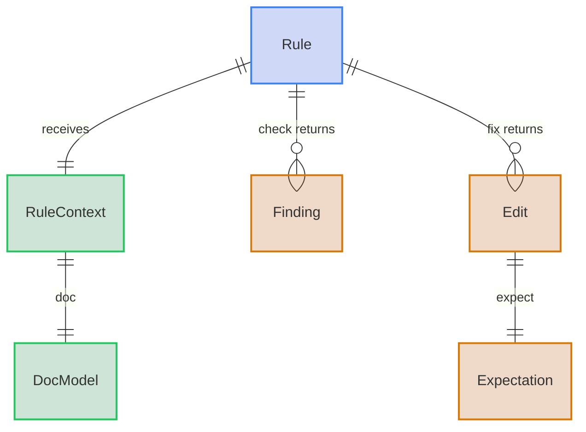

```mermaid
erDiagram
    Rule ||--|| RuleContext : "receives"
    RuleContext ||--|| DocModel : "doc"
    Rule ||--o{ Finding : "check returns"
    Rule ||--o{ Edit : "fix returns"
    Edit ||--|| Expectation : "expect"

    classDef ruleTint fill:#1d4ed836,stroke:#3b82f6,stroke-width:2px
    classDef inputTint fill:#15803d36,stroke:#22c55e,stroke-width:2px
    classDef outputTint fill:#b4530936,stroke:#d97706,stroke-width:2px
    class Rule ruleTint
    class RuleContext,DocModel inputTint
    class Finding,Edit,Expectation outputTint
```
