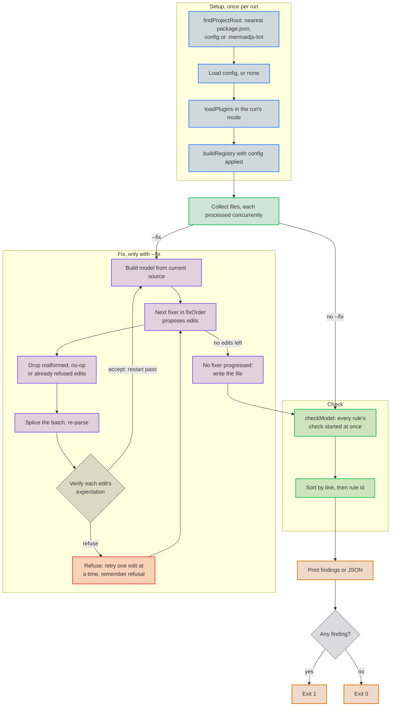

```mermaid
flowchart TB
    subgraph Setup["Setup, once per run"]
        R["findProjectRoot: nearest package.json,<br/>config or .mermaidjs-lint"]
        C["Load config, or none"]
        P["loadPlugins in the run's mode"]
        G["buildRegistry with config applied"]
    end
    F["Collect files, each processed concurrently"]
    subgraph Fix["Fix, only with --fix"]
        B["Build model from current source"]
        FX["Next fixer in fixOrder<br/>proposes edits"]
        W["Drop malformed, no-op<br/>or already refused edits"]
        SP["Splice the batch, re-parse"]
        V{"Verify each edit's<br/>expectation"}
        RF["Refuse: retry one edit at<br/>a time, remember refusal"]
        DN["No fixer progressed:<br/>write the file"]
    end
    subgraph Check["Check"]
        CM["checkModel: every rule's<br/>check started at once"]
        SO["Sort by line, then rule id"]
    end
    O["Print findings or JSON"]
    E{"Any finding?"}

    R --> C --> P --> G --> F
    F -->|"--fix"| B
    F -->|"no --fix"| CM
    B --> FX --> W --> SP --> V
    V -->|"accept: restart pass"| B
    V -->|refuse| RF --> FX
    FX -->|"no edits left"| DN --> CM
    CM --> SO --> O --> E
    E -->|yes| X1["Exit 1"]
    E -->|no| X0["Exit 0"]

    classDef setupTint fill:#1d4ed836,stroke:#3b82f6,stroke-width:2px
    classDef docTint fill:#15803d36,stroke:#22c55e,stroke-width:2px
    classDef fixTint fill:#6d28d936,stroke:#8b5cf6,stroke-width:2px
    classDef refuseTint fill:#dc262636,stroke:#ef4444,stroke-width:2px
    classDef reportTint fill:#b4530936,stroke:#d97706,stroke-width:2px
    classDef gateTint fill:#52525b36,stroke:#71717a,stroke-width:1px
    class R,C,P,G setupTint
    class F,CM,SO docTint
    class B,FX,W,SP,DN fixTint
    class RF refuseTint
    class O,X1,X0 reportTint
    class V,E gateTint
```
