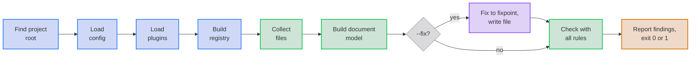

```mermaid
flowchart LR
    R["Find project<br/>root"] --> C["Load<br/>config"] --> P["Load<br/>plugins"] --> G["Build<br/>registry"]
    G --> F["Collect<br/>files"] --> M["Build document<br/>model"]
    M --> Q{"--fix?"}
    Q -->|yes| X["Fix to fixpoint,<br/>write file"]
    X --> K
    Q -->|no| K["Check with<br/>all rules"]
    K --> O["Report findings,<br/>exit 0 or 1"]

    classDef setupTint fill:#1d4ed836,stroke:#3b82f6,stroke-width:2px
    classDef docTint fill:#15803d36,stroke:#22c55e,stroke-width:2px
    classDef fixTint fill:#6d28d936,stroke:#8b5cf6,stroke-width:2px
    classDef reportTint fill:#b4530936,stroke:#d97706,stroke-width:2px
    classDef gateTint fill:#52525b36,stroke:#71717a,stroke-width:1px
    class R,C,P,G setupTint
    class F,M,K docTint
    class X fixTint
    class O reportTint
    class Q gateTint
```
