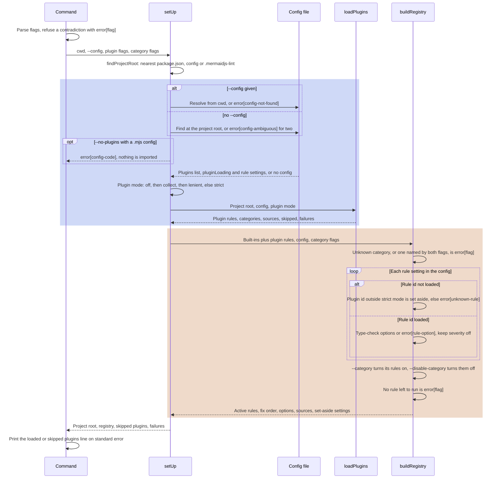

```mermaid
sequenceDiagram
    participant CLI as Command
    participant S as setUp
    participant C as Config file
    participant P as loadPlugins
    participant G as buildRegistry

    CLI->>CLI: Parse flags, refuse a contradiction with error[flag]
    CLI->>S: cwd, --config, plugin flags, category flags
    S->>S: findProjectRoot: nearest package.json, config or .mermaidjs-lint

    rect rgba(29, 78, 216, 0.21)
    alt --config given
        S->>C: Resolve from cwd, or error[config-not-found]
    else no --config
        S->>C: Find at the project root, or error[config-ambiguous] for two
    end
    opt --no-plugins with a .mjs config
        S-->>CLI: error[config-code], nothing is imported
    end
    C-->>S: Plugins list, pluginLoading and rule settings, or no config
    S->>S: Plugin mode: off, then collect, then lenient, else strict
    S->>P: Project root, config, plugin mode
    P-->>S: Plugin rules, categories, sources, skipped, failures
    end

    rect rgba(180, 83, 9, 0.21)
    S->>G: Built-ins plus plugin rules, config, category flags
    G->>G: Unknown category, or one named by both flags, is error[flag]
    loop Each rule setting in the config
        alt Rule id not loaded
            G->>G: Plugin id outside strict mode is set aside, else error[unknown-rule]
        else Rule id loaded
            G->>G: Type-check options or error[rule-option], keep severity off
        end
    end
    G->>G: --category turns its rules on, --disable-category turns them off
    G->>G: No rule left to run is error[flag]
    G-->>S: Active rules, fix order, options, sources, set-aside settings
    end

    S-->>CLI: Project root, registry, skipped plugins, failures
    CLI->>CLI: Print the loaded or skipped plugins line on standard error
```
