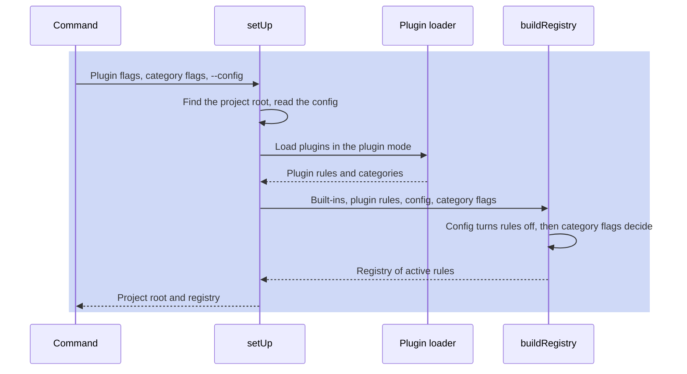

```mermaid
sequenceDiagram
    participant CLI as Command
    participant S as setUp
    participant P as Plugin loader
    participant G as buildRegistry

    rect rgba(29, 78, 216, 0.21)
    CLI->>S: Plugin flags, category flags, --config
    S->>S: Find the project root, read the config
    S->>P: Load plugins in the plugin mode
    P-->>S: Plugin rules and categories
    S->>G: Built-ins, plugin rules, config, category flags
    G->>G: Config turns rules off, then category flags decide
    G-->>S: Registry of active rules
    S-->>CLI: Project root and registry
    end
```
