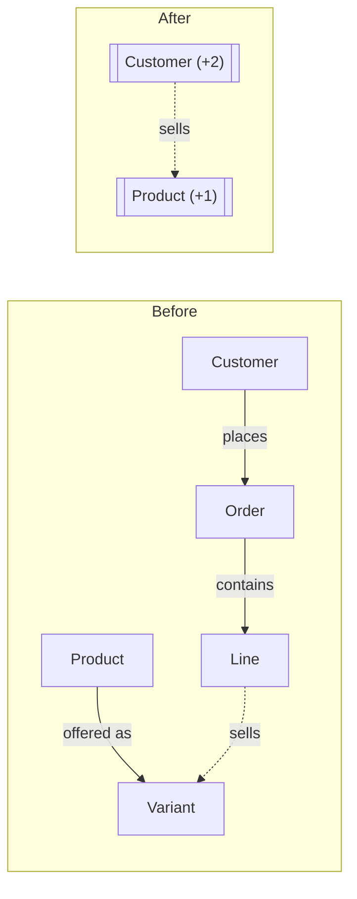

```mermaid
flowchart LR
    subgraph before [Before]
        C1[Customer] -->|places| O1[Order] -->|contains| L1[Line]
        P1[Product] -->|offered as| V1[Variant]
        L1 -.->|sells| V1
    end
    subgraph after [After]
        C2[["Customer (+2)"]] -.->|sells| P2[["Product (+1)"]]
    end
```
