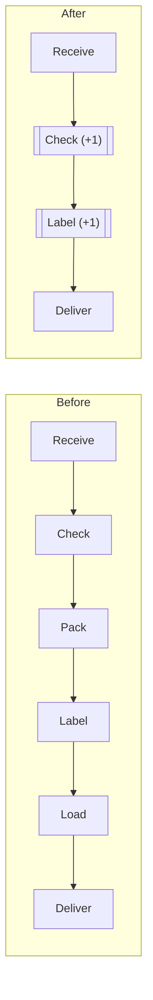

```mermaid
flowchart LR
    subgraph before [Before]
        A1[Receive] --> B1[Check] --> C1[Pack] --> D1[Label] --> E1[Load] --> F1[Deliver]
    end
    subgraph after [After]
        A2[Receive] --> B2[["Check (+1)"]] --> D2[["Label (+1)"]] --> F2[Deliver]
    end
```
