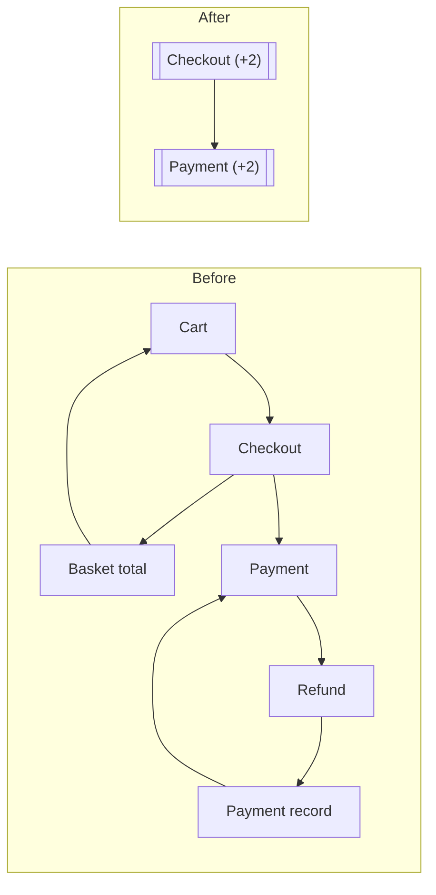

```mermaid
flowchart LR
    subgraph before [Before]
        A1[Cart] --> B1[Checkout]
        B1 --> C1[Basket total]
        C1 --> A1
        B1 --> D1[Payment]
        D1 --> E1[Refund]
        E1 --> F1[Payment record]
        F1 --> D1
    end
    subgraph after [After]
        A2[["Checkout (+2)"]] --> D2[["Payment (+2)"]]
    end
```
