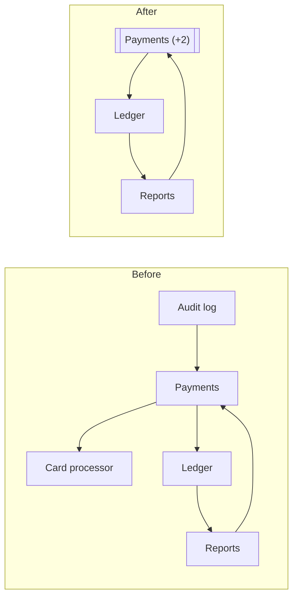

```mermaid
flowchart LR
    subgraph before [Before]
        L1[Audit log] --> H1[Payments]
        H1 --> K1[Card processor]
        H1 --> R1[Ledger]
        R1 --> Q1[Reports]
        Q1 --> H1
    end
    subgraph after [After]
        H2[["Payments (+2)"]] --> R2[Ledger]
        R2 --> Q2[Reports]
        Q2 --> H2
    end
```
