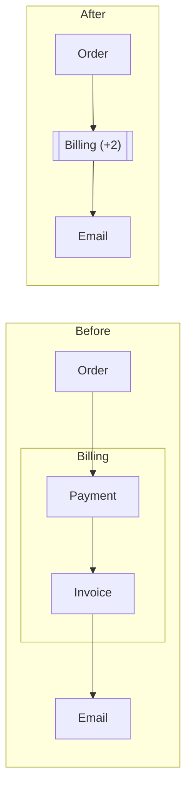

```mermaid
flowchart LR
    subgraph before [Before]
        O1[Order] --> P1
        subgraph billing [Billing]
            P1[Payment] --> I1[Invoice]
        end
        I1 --> E1[Email]
    end
    subgraph after [After]
        O2[Order] --> B2[["Billing (+2)"]]
        B2 --> E2[Email]
    end
```
