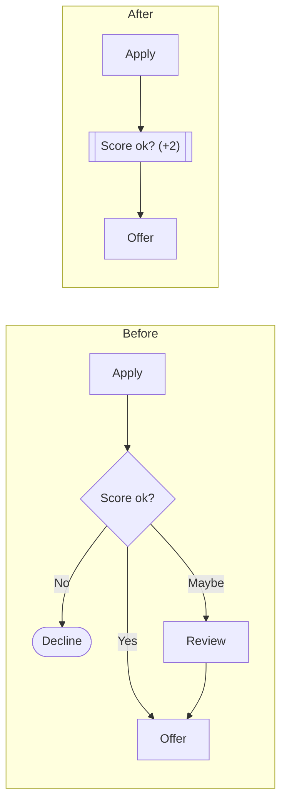

```mermaid
flowchart LR
    subgraph before [Before]
        A1[Apply] --> D1{Score ok?}
        D1 -->|No| R1([Decline])
        D1 -->|Yes| O1[Offer]
        D1 -->|Maybe| M1[Review] --> O1
    end
    subgraph after [After]
        A2[Apply] --> D2[["Score ok? (+2)"]] --> O2[Offer]
    end
```
