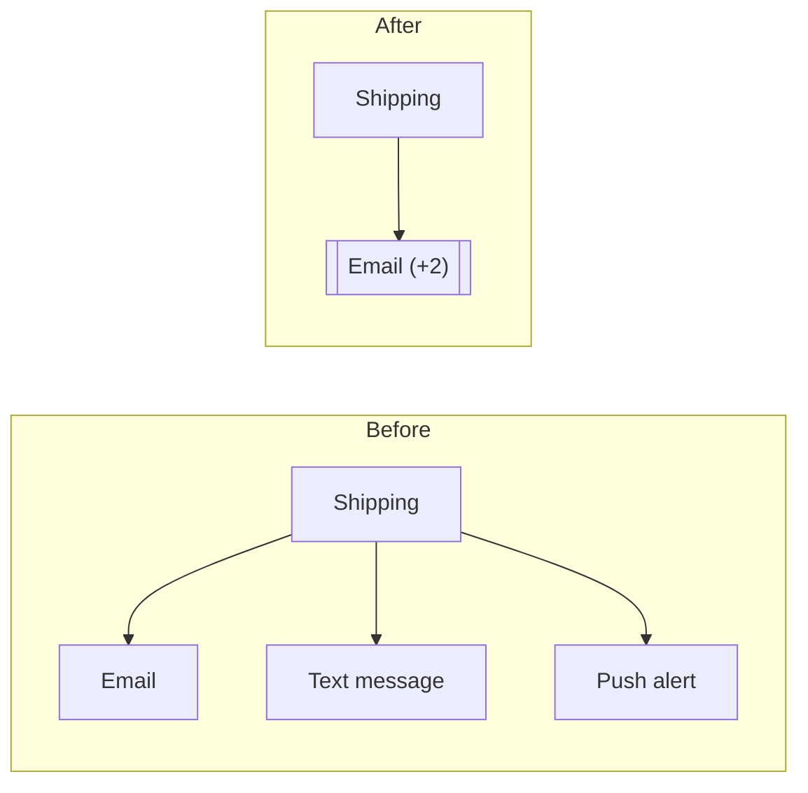

```mermaid
flowchart LR
    subgraph before [Before]
        S1[Shipping] --> M1[Email]
        S1 --> T1[Text message]
        S1 --> P1[Push alert]
    end
    subgraph after [After]
        S2[Shipping] --> M2[["Email (+2)"]]
    end
```
