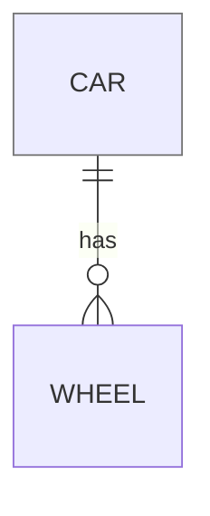

# White label on white fill

A directive whose text and fill are both white, in a diagram type where the pair is still audited.

```mermaid
erDiagram
  CAR ||--o{ WHEEL : has
  classDef c stroke:#767676
  class CAR c
```
