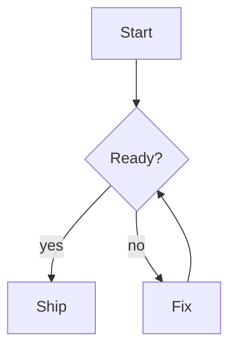

# No style directives

<!-- expect: none -->

Nothing to audit, so nothing is reported.

```mermaid
flowchart TD
  Start --> Check{Ready?}
  Check -- yes --> Ship
  Check -- no --> Fix --> Check
```
