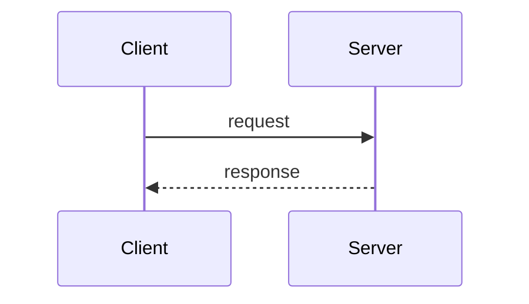
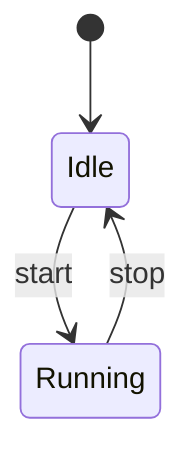
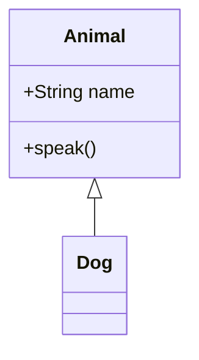

# Other diagram types

<!-- expect: none -->

```mermaid
sequenceDiagram
  Client->>Server: request
  Server-->>Client: response
```

```mermaid
stateDiagram-v2
  [*] --> Idle
  Idle --> Running: start
  Running --> Idle: stop
```

```mermaid
classDiagram
  class Animal {
    +String name
    +speak()
  }
  Animal <|-- Dog
```
