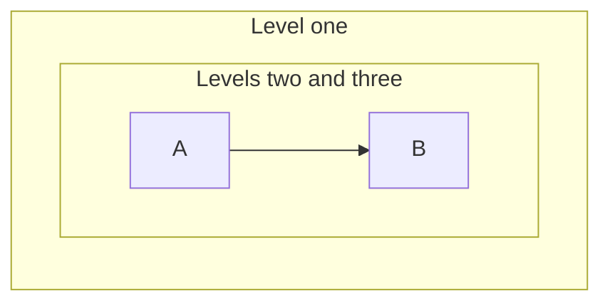

# Subgraphs nested three deep

<!-- llm: The third level held a single edge, so it merges into the second and the diagram keeps two levels of nesting. -->

```mermaid
flowchart LR
  subgraph L1[Level one]
    subgraph L2[Levels two and three]
      A --> B
    end
  end
```
