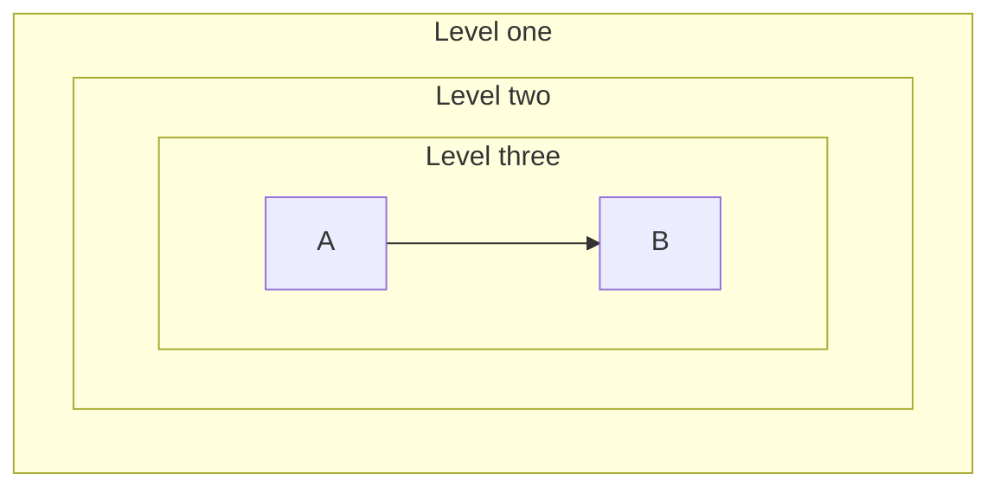

# Subgraphs nested three deep

<!-- expect: complexity-subgraph-nesting-too-deep -->

```mermaid
flowchart LR
  subgraph L1[Level one]
    subgraph L2[Level two]
      subgraph L3[Level three]
        A --> B
      end
    end
  end
```
