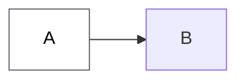

# Border below 3 to 1

<!-- llm: The near-white stroke vanished on the white fill, so it becomes a mid grey that clears 3 to 1 against the fill. -->

```mermaid
flowchart LR
  A --> B
  classDef c fill:#ffffff,color:#000000,stroke:#5f6368
  class A c
```
