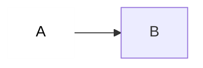

# Border below 3 to 1

<!-- expect: contrast-border-below-ui-minimum -->

The label passes, the stroke does not. There is no fixer, because the stroke is a design choice.

```mermaid
flowchart LR
  A --> B
  classDef c fill:#ffffff,color:#000000,stroke:#fefefe
  class A c
```
