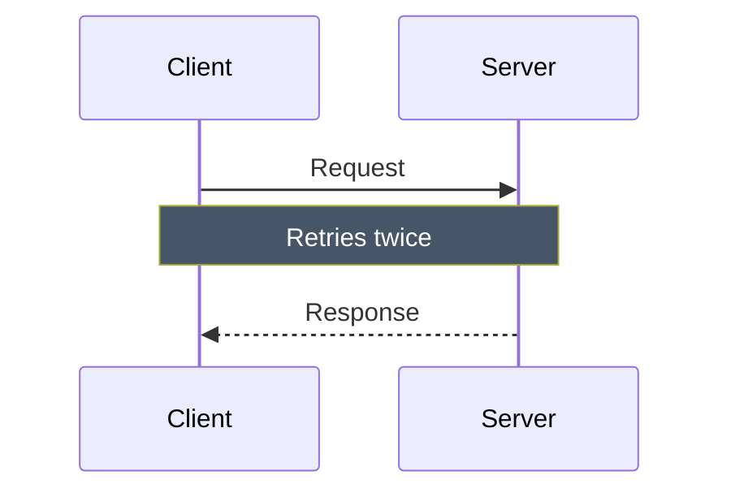

# Sequence note on Mermaid's dark theme

<!-- llm: A note draws its own opaque box, so one box and text pair reads in both themes. The diagram sets a slate box with white text. -->

```mermaid
---
config:
  themeVariables:
    noteBkgColor: "#475569"
    noteTextColor: "#ffffff"
---
sequenceDiagram
    participant C as Client
    participant S as Server
    C->>S: Request
    Note over C,S: Retries twice
    S-->>C: Response
```
