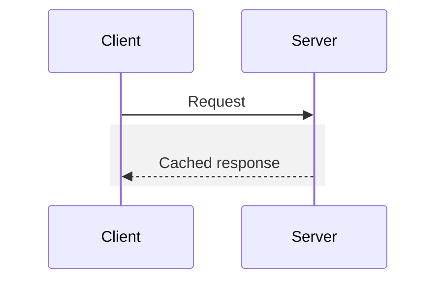

# Sequence rect in a light colour

<!-- llm: The message text and arrows flip with the theme, so the rect becomes a faint translucent grey that tints the page rather than replacing it. -->

```mermaid
sequenceDiagram
    participant C as Client
    participant S as Server
    C->>S: Request
    rect rgba(128, 128, 128, 0.1)
        S-->>C: Cached response
    end
```
