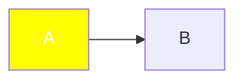

# Fixable text contrast

<!-- expect: contrast-text-below-aa -->

A pale grey label on yellow. The fixer swaps the declared `color:` for black.

```mermaid
flowchart LR
  A --> B
  classDef warn fill:#ffff00,color:#fefefe
  class A warn
```
